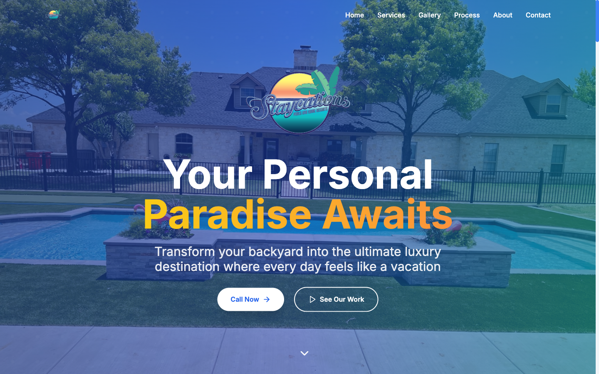
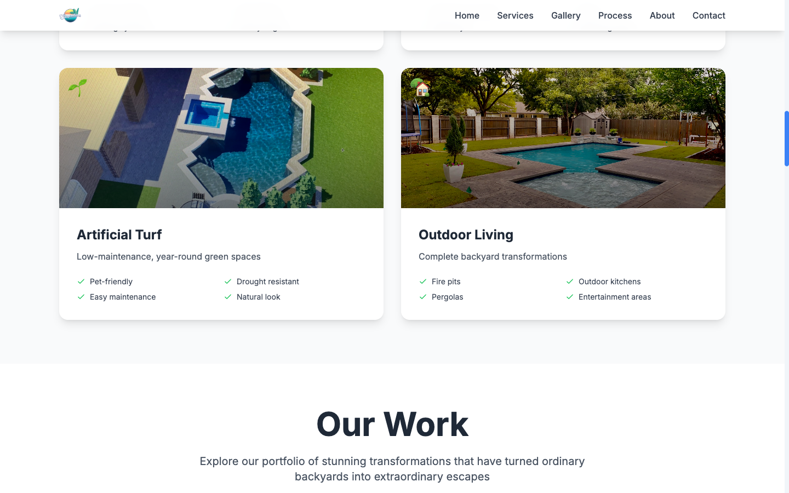
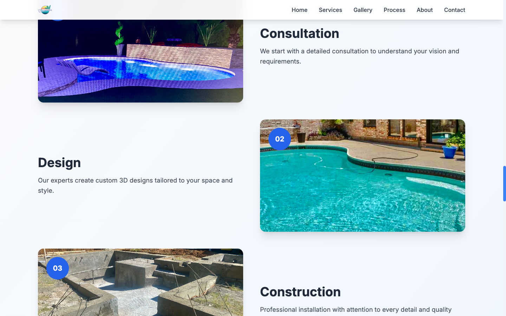

# Staycations — Pool Design & Outdoor Living

The live website for **Staycations**, a luxury pool design and outdoor living company serving DFW, Texas. Built with React + Vite and deployed as an Azure Static Web App.

**Live site:** https://staycationstx.com

## Screenshots







## Features

- React + Vite single-page site with smooth scroll sections
- Hero with video/photo backdrop and call CTAs
- Services grid (pool design, artificial turf, outdoor living)
- Project gallery ("Our Work") portfolio
- Process, About, and Contact sections
- Fully responsive — mobile, tablet, desktop
- SEO meta + Open Graph tags

## Tech Stack

- **React** — component-based UI
- **Vite** — fast dev server and production builds
- **Azure Static Web Apps** — hosting + CI deploy on push

## Getting Started

```bash
git clone https://github.com/okekedev/staycations.git
cd staycations
npm install
npm run dev
```

Production build:

```bash
npm run build
```

## Reuse as a Template

The structure works well as a starter for any local-service business site (pools, landscaping, contractors): swap the images in `public/`, edit the section content in `src/`, and restyle the palette.

## License

Free to use.
